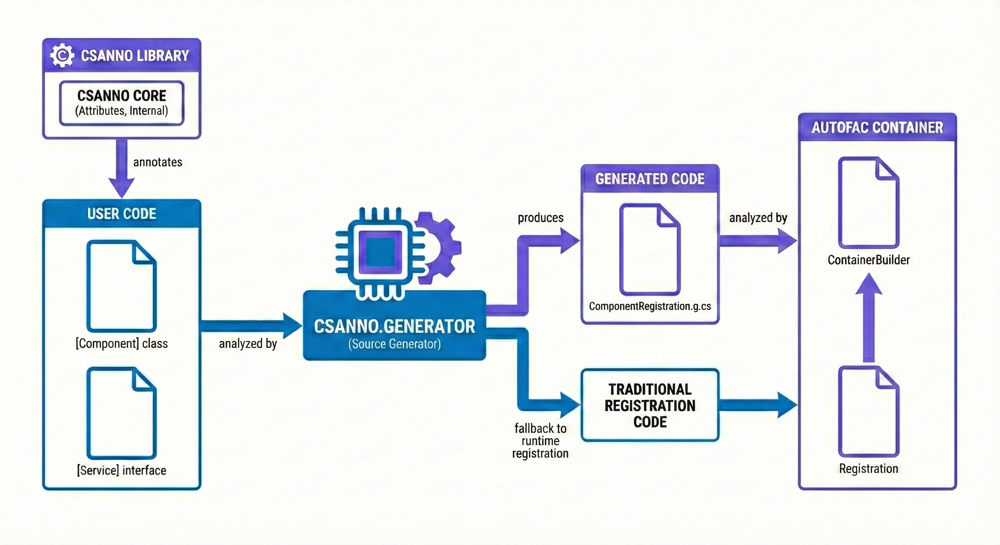
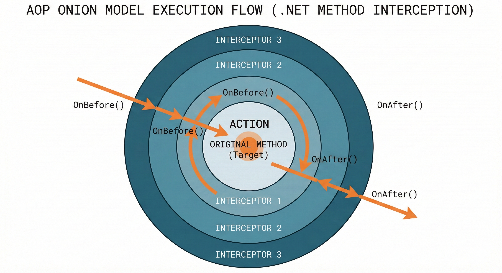

** This project uses Vibe Coding throughout for testing and exploring AI capabilities.

# Csanno

> C# Annotation-based Component Registration - Spring-style Development Experience for Autofac



[](https://dotnet.microsoft.com/download/dotnet/10.0)
[](https://autofac.org/)
[](#)

**[中文文档](doc/README.zh-CN.md)**

## Project Origin

**This is a project entirely generated by AI.**

Development tools and methods used:
- Vibe Coding
- Claude Code + GLM-4.7
- GitHub Copilot for code completion
- Antigravity + Claude Opus 4.5
- Open Code + Oh My Open Code + GLM-4.7
- Open Code + Oh My Open Code + DeepSeek Reasoner

Originally, I manually implemented a project called `csharp-annotation`, attempting to achieve Java Spring-like annotation-based component registration on Autofac. Later, I decided to let AI re-implement this idea, and the results were amazing—the AI-implemented version is much better than my handwritten one:

- **Higher code quality**: Clear structure, standardized naming, comprehensive comments
- **More complete features**: Covers various Autofac lifecycle modes
- **Thorough testing**: Full coverage including edge cases and exception handling
- **Standardized documentation**: Clear structure and synchronized project docs

This project demonstrates the enormous potential of AI-assisted programming—not just code generation, but full participation in architecture design and testing.

## Why This Project?

Autofac is one of the most popular IoC containers in the .NET ecosystem, but it requires explicit registration for each component by default:

```csharp
// Traditional Autofac registration
builder.RegisterType<UserService>().As<IUserService>();
builder.RegisterType<OrderService>().As<IOrderService>();
builder.RegisterType<PaymentService>().As<IPaymentService>();
// ... dozens of service registrations
```

This approach has the following issues:

1. **Tedious and error-prone**: Each new service requires manual registration
2. **High maintenance cost**: Services are separated from registration code, easy to miss during refactoring
3. **Doesn't match modern development habits**: Java Spring and .NET Core DI both support annotation/attribute-driven development

**Csanno's goal**: Bring Java Spring's `@Component` style development experience to Autofac, making dependency injection simple again.

## Features

### ⚡ Compile-time Code Generation (Source Generator)

Csanno now supports **Roslyn Source Generator**, generating component registration code at compile time with the following advantages:

- **Zero runtime overhead**: No assembly scanning, faster startup
- **AOT friendly**: Supports Native AOT and Assembly Trimming
- **Type safe**: Compile-time checking of all type references
- **Better performance**: Generated code directly calls Autofac API, no reflection overhead

The generator automatically detects and prefers compile-time generated code, falling back to runtime scanning if unavailable.

### Supported Lifecycles

| Attribute | Autofac Equivalent | Description |
|-----------|-------------------|-------------|
| `[Component]` | - | Marks a class as a component (default Transient) |
| `[Transient]` | `InstancePerDependency()` | New instance per request |
| `[Scoped]` | `InstancePerLifetimeScope()` | One instance per lifetime scope |
| `[Singleton]` | `SingleInstance()` | Global singleton |
| `[PerRequest]` | `InstancePerRequest()` | One instance per HTTP request |
| `[PerMatchingLifetimeScope("tag")]` | `InstancePerMatchingLifetimeScope()` | Match specified scope tag |
| `[Owned]` | `InstancePerOwned()` | Owned instance management |

### Advanced Features

- **Compile-time code generation**: Source Generator automatically generates registration code, zero runtime overhead
- **Service interface mapping**: `[AsService(typeof(IService))]`
- **Multiple service interfaces**: One component can register as multiple services
- **Metadata support**: `[WithMetadata("key", value)]` (compile-time constants only; supports string/bool/int/long/double/char/enum/typeof)
- **Component attribute inheritance**: Derived classes can inherit `[Component]`, and `ComponentAttribute.ServiceType` can be specified multiple times
- **Automatic assembly scanning**: Automatically discovers and registers all marked components
- **Type safety**: Compile-time checking, avoiding runtime errors
- **Smart filtering**: Automatically excludes static classes, abstract classes, and classes without public constructors
- **AOP interception**: Supports method before/after interception, compile-time proxy class generation

### 🎯 AOP Method Interception

Csanno supports Source Generator-based AOP functionality, generating proxy classes at compile time for method before/after interception:



*The diagram above illustrates the Onion Model execution flow: Interceptors wrap the original method in layers, executing logic both before and after the method call.*

- **Zero runtime reflection**: Proxy classes generated at compile time
- **No external dependencies**: No need for Castle.DynamicProxy or other third-party libraries
- **Multiple interceptor support**: Multiple interceptors can bind to the same annotation
- **Nested call chain**: Onion model, OnBefore/OnAfter called in nested order
- **Call control**: OnBefore returns bool to control whether to execute original method
- **InvokeType configuration**: Flexible configuration of original method invocation behavior (MustInvoke, NeverInvoke, etc.)
- **InvokeResult**: All interceptor methods receive an `InvokeResult` parameter to modify/provide return values
- **Type safety**: Compile-time checking of interceptor bindings

**Usage Steps**:

#### 1. Define Interceptor Annotation

```csharp
using Csanno.Attributes;

// Custom annotation must inherit from BaseInterceptAttribute
public class LoggingAttribute : BaseInterceptAttribute
{
    public string AdditionalInfo { get; set; } = "";
}
```

#### 2. Implement Interceptor

```csharp
using Csanno.Attributes;

// Interceptor must inherit from BaseInterceptor
// Use [BindWith<T>] to bind interceptor to annotation (auto-registered as component, no [Component] needed)
[BindWith<LoggingAttribute>]
public class LoggingInterceptor : BaseInterceptor
{
    // OnBefore returns bool: true allows original method execution, false blocks it
    // Note: This only controls whether the original method is invoked, only applies to void methods
    public override bool OnBefore(MethodInfo method, object?[] args, InvokeResult invokeResult)
    {
        Console.WriteLine($"Entering {method.Name}");
        return true; // Allow execution to continue
    }

    // OnAfter is always called, regardless of OnBefore return value
    public override void OnAfter(MethodInfo method, object? result)
    {
        Console.WriteLine($"Exiting {method.Name} with result: {result}");
    }
}
```

#### 3. Mark Methods for Interception

```csharp
[Component]
public class CalculatorService
{
    // Methods must be virtual to be intercepted
    [Logging]
    public virtual int Add(int a, int b)
    {
        return a + b;
    }
}
```

#### 4. Register AOP Proxies

```csharp
var builder = new ContainerBuilder();
builder.RegisterComponents();   // Register components
builder.RegisterAopProxies();   // Register AOP proxy classes
var container = builder.Build();

var calculator = container.Resolve<CalculatorService>();
calculator.Add(1, 2);  // Will trigger interceptor
// Output:
// Entering Add
// Exiting Add with result: 3
```

> ⚠️ **Note**:
> - Only public methods declared as `virtual` can be intercepted
> - Interceptor annotations must inherit from `BaseInterceptAttribute`
> - `[BindWith<T>]` inherits from `[Component]`, no need to mark again

#### 5. InvokeType Configuration

Configure interceptor's control behavior for original method invocation via the `InvokeType` property:

```csharp
// Force invoke original method, ignoring OnBefore return value
[BindWith<CachingAttribute>(InvokeType = InvokeType.MustInvoke)]
public class CacheInterceptor : BaseInterceptor { ... }

// Never invoke original method
[BindWith<MockAttribute>(InvokeType = InvokeType.NeverInvoke)]
public class MockInterceptor : BaseInterceptor { ... }
```

| InvokeType | Description |
|------------|-------------|
| `Default` | Same as WhenAllTrue |
| `MustInvoke` | Force invoke original method |
| `NeverInvoke` | Never invoke original method |
| `WhenAllTrue` | Invoke when all OnBefore return true |
| `WhenAnyFalse` | Invoke when any OnBefore returns false |
| `WhenAnyTrue` | Invoke when any OnBefore returns true |

#### 6. Nested Call Chain (Onion Model)

Multiple interceptors are called in nested structure:

```
I1.OnBefore → I2.OnBefore → I3.OnBefore → [Original Method] → I3.OnAfter → I2.OnAfter → I1.OnAfter
```

- **OnBefore** returning `false` will block original method execution (unless MustInvoke is present). Note: This only controls invocation, only applies to void methods.
- **OnAfter** is always called, regardless of OnBefore return value


## Installation

### NuGet Package Installation

```bash
dotnet add package Csanno
```

Or add to `.csproj`:

```xml
<ItemGroup>
  <PackageReference Include="Csanno" Version="0.1.0" />
  <PackageReference Include="Autofac" Version="8.0.0" />
</ItemGroup>
```

### Source Generator Auto-enabled

After installing the NuGet package, Source Generator will automatically enable and generate component registration code at compile time.

If using project reference, ensure the generator project is included:

```xml
<ItemGroup>
  <ProjectReference Include="..\src\Csanno.csproj" />
  <ProjectReference Include="..\src\Csanno.Generator\Csanno.Generator.csproj"
                    OutputItemType="Analyzer"
                    ReferenceOutputAssembly="false" />
</ItemGroup>
```

## Quick Start

### 1. Define Components

```csharp
using Csanno.Attributes;

// Basic component
[Component]
public class UserService
{
    public string Greet() => "Hello from UserService";
}

// Singleton service
[Component]
[Singleton]
public class CacheService
{
    // Globally unique instance
}

// Scoped service
[Component]
[Scoped]
public class DbContext
{
    // One instance per scope
}

// Service implementing interfaces
public interface IUserRepository { }
public interface IRepository { }

[Component]
[AsService(typeof(IUserRepository))]
[AsService(typeof(IRepository))]
[Transient]
public class UserRepository : IUserRepository, IRepository
{
    // Supports multiple interface registration
}
```

### 2. Register Components

```csharp
using Autofac;
using Csanno;

var builder = new ContainerBuilder();

// Automatically uses compile-time generated code (priority) or runtime scanning (fallback)
builder.RegisterComponents();
var container = builder.Build();
```

**How it works**:
1. `RegisterComponents()` first checks for compile-time generated registration code
2. If generated code is found, it calls directly (zero runtime overhead)
3. If not found, falls back to runtime assembly scanning
4. Developers don't need to worry about which method is used, API remains consistent

**Other registration methods**:

```csharp
// Scan specified assembly
builder.RegisterComponents(typeof(UserService).Assembly);

// Scan multiple assemblies
builder.RegisterComponents(
    typeof(UserService).Assembly,
    typeof(OrderService).Assembly
);

// Locate assembly from type
builder.RegisterComponentsFromType<UserService>();
```

### 3. Resolve Services

```csharp
// Basic resolution
var userService = container.Resolve<UserService>();

// Interface resolution
var repository = container.Resolve<IUserRepository>();

// Resolution with metadata
using var meta = container.Resolve<Meta<IRepository>>();
var tags = meta.Metadata["Tags"];
```

## Advanced Usage

### Metadata Registration

```csharp
[Component]
[AsService(typeof(IPaymentProvider))]
[WithMetadata("Name", "Alipay")]
[WithMetadata("Priority", 1)]
[WithMetadata("Enabled", true)]
public class AlipayProvider : IPaymentProvider { }

// Selection using metadata
var providers = container.Resolve<IEnumerable<Meta<IPaymentProvider>>>();
var alipay = providers.First(p => p.Metadata["Name"].ToString() == "Alipay");
```

Supported metadata literal types (compile-time constants): `string`, `bool`, `int`, `long`, `double`, `char`, `enum`, `typeof`.

### Lifetime Scopes

```csharp
// Scoped lifetime
using var scope = container.BeginLifetimeScope();
var db1 = scope.Resolve<DbContext>();
var db2 = scope.Resolve<DbContext>();
Assert.AreSame(db1, db2); // Same instance within same scope
```

### PerMatchingLifetimeScope

```csharp
[Component]
[PerMatchingLifetimeScope("request")]
public class RequestScopedService { }

// Only available in matching tagged scope
using var requestScope = container.BeginLifetimeScope("request");
var service = requestScope.Resolve<RequestScopedService>(); // OK

using var otherScope = container.BeginLifetimeScope();
var service2 = otherScope.Resolve<RequestScopedService>(); // Throws exception
```

### Owned Instances

```csharp
[Component]
[Owned]
public class DisposableResource : IDisposable
{
    public void Dispose() { /* Cleanup resources */ }
}

// Use Owned to automatically manage lifecycle
using var owned = container.Resolve<Owned<DisposableResource>>();
owned.Value.DoWork();
// Dispose is automatically called when owned leaves scope
```

## Development & Testing

This project uses **Claude Code native Plan mode**, with complete test coverage for all features.

### Development Mode

#### 1. Claude Code Plan Mode

This project extensively uses Claude Code's native Plan mode for architecture design and implementation:

```bash
# Enter Plan mode
/plan

# Claude Code will automatically:
# 1. Analyze codebase structure
# 2. Design implementation approach
# 3. Create detailed implementation plan
# 4. Wait for user approval before executing
```

**Plan mode advantages**:
- **Architecture first**: Complete design before writing code
- **Visual review**: Users can review entire plan before execution
- **Reduce rework**: Avoid rewrites due to misunderstanding
- **Knowledge retention**: Plan documents can be saved as project documentation

**Modules implemented using Plan mode**:
- Roslyn Source Generator complete architecture design
- Component scanning and registration logic
- Lifecycle management mechanism

### Testing

```bash
# Run tests
dotnet test

# View test coverage
dotnet test --collect:"XPlat Code Coverage"
```

### Test Modules

- **Lifecycle tests**: Transient, Scoped, Singleton and various lifecycles
- **Service mapping tests**: Interface mapping, multiple interface registration
- **Metadata tests**: Metadata registration and retrieval
- **Edge case tests**: Abstract classes, static classes, parameterless constructors, etc.
- **Dependency injection tests**: Constructor injection, nested dependencies

## Project Structure

```
Csanno/
├── src/
│   ├── Attributes/          # Annotation attributes (incl. IInterceptor, BindWithAttribute)
│   ├── Internal/            # Internal implementation (scanning, registration)
│   ├── Csanno.Generator/    # Roslyn Source Generator
│   │   ├── Models/          # Component and proxy info models
│   │   ├── Emit/            # Code emitters (incl. ProxyEmitter)
│   │   ├── ComponentGenerator.cs   # Component registration generator
│   │   └── InterceptorGenerator.cs # AOP proxy class generator
│   └── RegistrationExtensions.cs   # Public API
├── tests/
│   ├── Fixtures/            # Test utilities
│   ├── TestComponents/      # Test components
│   │   └── Aop/             # AOP test components (interceptor examples)
│   ├── Aop/                 # AOP feature tests
│   └── Registration/        # Registration feature tests
│       ├── Lifetime/        # Lifecycle tests
│       ├── Services/        # Service registration tests
│       ├── Metadata/        # Metadata tests
│       ├── Owned/           # Owned instance tests
│       ├── Dependencies/    # Dependency injection tests
│       └── EdgeCases/       # Edge case tests
```

### Source Generator How It Works


Csanno.Generator is a Roslyn Source Generator that executes the following steps at compile time:

1. **Syntax analysis**: Scans all classes with `[Component]` (including inherited/derived attributes)
2. **Information extraction**: Extracts lifecycle, service mapping, metadata, etc.
3. **Code generation**: Generates `RegisterGeneratedComponents()` method
4. **Output file**: Writes generated code to `obj/Generated` directory

Generated code example:

```csharp
// Auto-generated file (obj/Generated/Csanno.Generator/.../ComponentRegistration.MyAssembly.g.cs)
public static partial class ComponentRegistrationExtensions
{
    public static void RegisterGeneratedComponents(this ContainerBuilder builder)
    {
        builder.RegisterType<UserService>().InstancePerDependency()
            .As<IUserService>();
        builder.RegisterType<CacheService>().SingleInstance();
        // ... more component registrations
    }
}
```

## Why Doesn't Autofac Include This Feature?

This is a common question. As a mature IoC container, Autofac may have chosen not to include annotation-based registration for the following reasons:

1. **Explicit over implicit**: The .NET community tends to prefer explicit registration, considering it clearer
2. **Performance considerations**: Assembly scanning has some performance overhead
3. **Flexibility**: Explicit registration allows finer control over registration behavior
4. **Historical reasons**: When Autofac was designed (2008), annotation-driven was not popular

But with the popularity of Java Spring and .NET Core DI, more developers expect this development style. **Csanno exists to fill this gap**—allowing developers who prefer annotation-driven style to enjoy a similar experience on Autofac.

## Roadmap

- [x] Source Generator generates registration code (zero performance overhead)
- [x] AOP method interception (compile-time proxy class generation)
- [x] Nested interceptor call chain (onion model)
- [x] OnBefore returns bool to control original method execution
- [x] InvokeType enum configures invocation behavior
- [ ] `@PostConstruct` / `@PreDestroy` lifecycle callbacks
- [ ] Conditional registration (`@Conditional`)
- [ ] Dependency filtering (`@Autowired(required = false)`)
- [ ] .NET Generic Host integration
- [ ] Property injection support
- [ ] Generic component registration

## Performance Comparison

### Source Generator vs Runtime Scanning

| Metric | Source Generator | Runtime Scanning |
|--------|------------------|------------------|
| Startup time | ~0ms | 10-50ms |
| Memory usage | No extra overhead | Needs reflection info cache |
| AOT support | ✅ Fully supported | ❌ Not supported |
| Assembly Trimming | ✅ Safe | ❌ May break |
| Type safety | ✅ Compile-time check | ⚠️ Runtime check |

**Source Generator advantages**:
- All work done at compile time, runtime directly calls generated code
- No reflection, no memory cache overhead
- Supports Native AOT and Assembly Trimming
- Better debugging experience (can see generated code)

## License

MIT License

## Acknowledgments

- [Autofac](https://autofac.org/) - Powerful IoC container
- [Claude Code](https://claude.com/claude-code) & [GLM-4.7](https://open.bigmodel.cn/) - AI-assisted development
- [Spring Framework](https://spring.io/) - Inspiration for annotation-driven design

---

**Generated by AI, serving developers.** | [GitHub](https://github.com/BeanYa/csanno)
